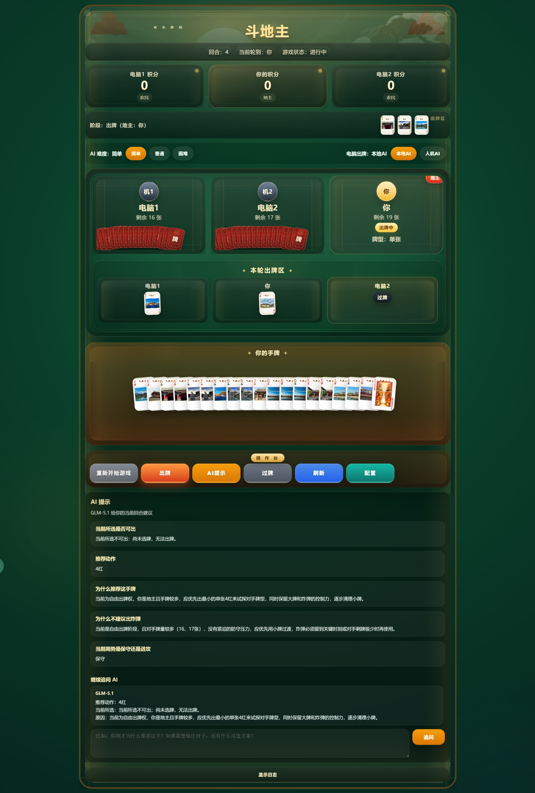

# 斗地主 - 网页版 + WebAssembly 内核 + AI 辅助 🃏

一个可直接在浏览器运行的完整斗地主游戏，前端采用原生 HTML/CSS/JavaScript 开发，**核心游戏规则与本地 AI 逻辑由 C 语言实现并编译为 WebAssembly**，同时深度集成大模型能力，提供出牌提示、对局复盘、AI 决策等增强功能。试玩网址:https://tian11111.github.io/doudizhu/%E6%96%97%E5%9C%B0%E4%B8%BB/

---
<p align="center">
  
</p>

---

## ✨ 项目亮点
- **开箱即用**：纯网页单页应用，无需安装，打开浏览器即可游玩
- **高性能内核**：发牌、抢地主、牌型识别、跟牌校验、胜负判定全在 C 层实现
- **多难度本地 AI**：内置「简单 / 普通 / 困难」三档电脑出牌策略
- **双模式对战**：支持「本地 AI」和「大模型人机 AI」两种电脑玩家模式切换
- **完整大模型能力**：
  - 局中实时 **AI 出牌提示**
  - 局后自动 **AI 复盘分析**
  - 对话式 **继续追问**
  - 电脑玩家大模型 **全程决策**
- **沉浸式体验**：自带高清牌面素材、全套音效（发牌/出牌/炸弹/王炸/胜负）、流畅动画

---

## 🎮 游戏流程
1. 启动游戏 → 2. 抢地主阶段 → 3. 玩家与两名电脑轮流出牌
2. 局中可随时点击「AI 提示」获取最优出牌建议
3. 对局结束后，查看「AI 复盘」分析关键转折点

---

## 🧩 页面核心功能
| 功能模块                | 说明                                  |
|-------------------------|---------------------------------------|
| 游戏状态展示            | 当前阶段（抢地主/出牌/结算）、回合信息 |
| 玩家信息面板            | 身份（地主/农民）、积分、剩余牌数     |
| 牌型交互区              | 手牌区（可点击选牌）、出牌区、结算区  |
| AI 配置面板             | 模型接口、API Key、参数设置           |
| 辅助功能                | 音效开关、显示设置、重新开始          |

---

## 🏗️ 技术架构
### 前端层
- `index.html`：主界面布局、交互逻辑、AI 调用、音效渲染
- `game.js`：Emscripten 生成的 WebAssembly 胶水代码
- 原生 CSS：界面样式与动画效果

### C / WebAssembly 核心层
- `1.c`：斗地主核心规则、游戏流程控制、前端调用接口导出
- `ai_logic.c / ai_logic.h`：本地 AI 出牌策略、抢地主逻辑
- `game_shared.h`：公共结构体、枚举类型、函数声明

### 大模型接口层
- `qwen_client.c / qwen_client.h`：兼容 OpenAI Chat Completions 格式的 C 端调用封装
- `qwen_example_usage.c`：对局分析、复盘请求的示例代码

### 资源文件
- `牌组/`：扑克牌高清图片资源（黑桃/红桃/梅花/方块/大小王）
- 音效文件：`deal.mp3`（发牌）、`bomb.mp3`（炸弹）、`win.mp3`（胜利）等

---

## 🚀 本地运行指南
由于需要加载 `game.wasm` 文件，**不可直接双击 index.html 用 file:// 协议打开**，需通过本地静态服务器启动：

### 方式 1：Python（推荐，无需额外安装）
```bash
# 启动本地服务器，端口 8000
python -m http.server 8000
```
浏览器访问：  
`http://localhost:8000`

### 方式 2：Node.js（需提前安装 Node.js）
```bash
# 临时启动静态服务器（无需全局安装）
npx serve .
```
浏览器访问终端输出的本地地址（通常是 `http://localhost:3000`）

---

## 🤖 AI 配置说明
页面内置可视化 AI 配置面板，支持**所有兼容 OpenAI Chat Completions 格式**的模型接口，配置步骤如下：

### 配置项
1. `API 网址`：模型接口地址（如 OpenAI 官方 `https://api.openai.com/v1/chat/completions`）
2. `模型名称`：具体模型标识（如 `gpt-3.5-turbo`、`qwen-turbo`）
3. `API Key`：你的接口密钥

### 支持功能
| 功能          | 说明                                  |
|---------------|---------------------------------------|
| AI 提示       | 分析当前局面，给出最优出牌建议        |
| AI 复盘       | 对局结束后，分析关键失误、胜负原因    |
| 继续追问      | 基于上一轮 AI 输出，深入提问（如「为什么这步要出对子」） |
| 人机 AI 模式  | 电脑玩家由大模型规划连续出牌策略      |

> 注：页面已预置部分主流模型服务商示例，也支持自定义配置任意兼容接口。

---

## 📌 可扩展方向
- [ ] 实现 **联机对战**（支持多玩家实时匹配）
- [ ] 完善自动化构建脚本（统一生成 `game.js` 与 `game.wasm`）
- [ ] 增加更多 AI 预设模板与自定义 Prompt 配置
- [ ] 开发战绩统计面板（胜率、场均得分、炸弹次数等）
- [ ] 支持对局回放功能
- [ ] 拆分前端脚本（将 `index.html` 中的 JS 分离为独立文件，提升可维护性）
- [ ] 优化移动端适配，支持触屏操作

---

## 📄 项目说明
本项目是一个 **「玩法完整 + AI 能力增强」** 的斗地主实验项目，适合用于：
- 浏览器棋牌小游戏开发学习
- C 语言规则引擎 + WebAssembly 前端集成实践
- 大模型辅助决策、讲解、复盘的产品原型
- 人机对战类应用快速迭代

如果你觉得项目有意思，欢迎提交 Issue 反馈问题，或通过 Pull Request 共同完善！

---
